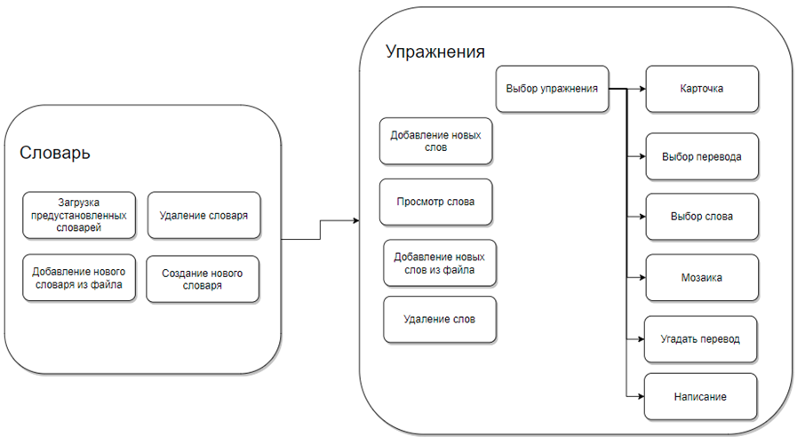
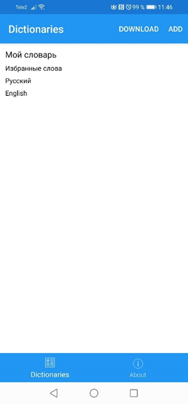
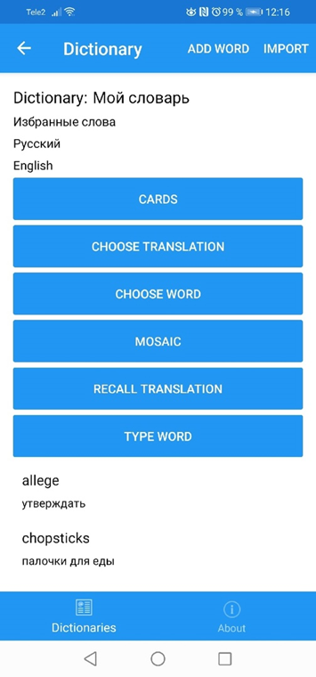
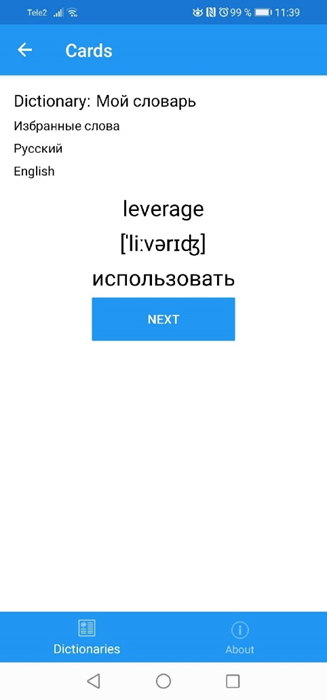
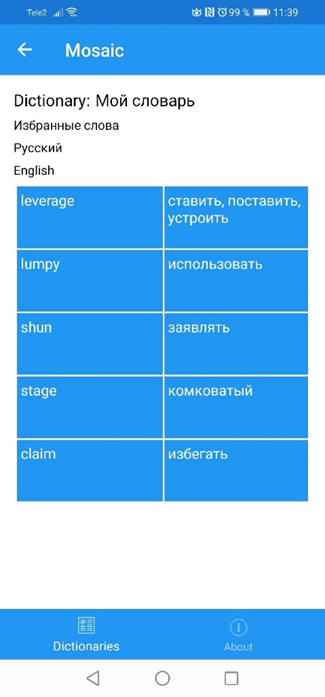
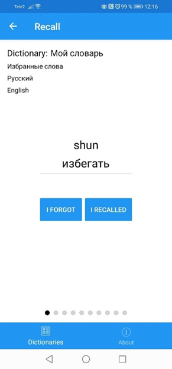

# LearnWords

1.	Возможность импортировать своего словаря,
2.	Выбрать метод обучения,
3.	Просмотр слов входящих в словари,
4.	Проверять ответы на задания,
5.	Редактирование, удаление, добавление слов внутри словаря,

Приложение состоит из двух различных по функциональности модулей, отвечающих за словарь, упражнения и словари

- Интерфейс списка словарей

- Интерфейс меню упражнений

- Интерфейс упражнения Карточка

- Интерфейс упражнения Мозаика

- Интерфейс упражнения Написание 

